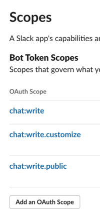

# Server Monitoring Script (with reporting to Slack)

[](https://github.com/ohjho/Server-Monitoring-Script/blob/master/LICENSE.md) [](https://travis-ci.com/ohjho/Server-Monitoring-Script)
[](https://codecov.io/gh/ohjho/Server-Monitoring-Script)  

## Purpose

The Python script is a **modified version of [mfcodeworks' version](https://github.com/mfcodeworks/Server-Monitoring-Script)** designed to be run as a ~cronjob~ [supervisor process](http://supervisord.org/) on every boot in the background.
The script will gather information **and send updates in the form of a Slack message**:

- UUID (Unique for each system to avoid overlapping hostname for multi-network monitoring)
- Hostname
- CPU
- Memory
- Network Usage
- Network Cards
- Hard Drives
- **GPU Memory**
- System OS
- System Uptime
- UTC Timestamp

The script will produce a JSON output at intervals for use with any software or server accepting a JSON input.
Example:

```json
{
    "hostname": "HOME-LAPTOP1",
    "system": {
        "name": "Windows",
        "version": "10"
    },
    "uptime" : 231199,
    "cpu_count": 4,
    "cpu_usage": 17.9,
    "memory_total": 8440942592,
    "memory_used": 6244225024,
    "memory_used_percent": 74.0,
    "drives": [
        {
            "name": "C:\\",
            "mount_point": "C:\\",
            "type": "NTFS",
            "total_size": 536224985088,
            "used_size": 167306108928,
            "percent_used": 31.2
        },
        {
            "name": "D:\\",
            "mount_point": "D:\\",
            "type": "NTFS",
            "total_size": 463332921344,
            "used_size": 49498419200,
            "percent_used": 10.7
        }
    ],
    "root_drive_used_percent" : 88.6,
    "network_up": 54,
    "network_down": 4150,
    "network_cards": [
        {
            "address": "127.0.0.1",
            "address6": "::1",
            "mac": "",
            "name": "Loopback Pseudo-Interface 1",
            "netmask": "255.0.0.0"
        },
        {
            "address": "10.15.62.112",
            "address6": "fe80::844d:a87:54ea:2100",
            "mac": "1C-39-47-A6-4C-5E",
            "name": "Ethernet",
            "netmask": "255.255.0.0"
        }
    ],
    "timestamp" : "2018-10-10T01:41:21+00:00",
    "uuid" : 180331603484325,
    "gpu_memory_max_used_percent" : 26.53
}
```

This script can be installed on several machines that report to a central Slack channel.

The destination, checking interval, sending attempts after failure and timeout between resending attempts can be set through arguments, use `python3 server_monitor.py -h` for more.

## Usage

Shallow Clone the repo with `git clone --depth 1 https://github.com/ohjho/Server-Monitoring-Script.git`.

Make sure you have Python 3.7 and install the required libraries `pip3 install -r requirements.txt`.

To test the script output run `python3 server_monitor.py`.

### Use with a config file
You can supply a config file by `python3 server_monitor.py -c config.yaml` to gain more control of the monitor and only get slack messages when limits are reached. [Here's](config_example.yaml) an example config file:
```
dev:
  environment:
    interval: 30    # seconds, monitoring interval
    attempts: 10    # deprecated: retry send message for this many times
    timeout: 60     # deprecated: send message timeout after waiting for this many seconds
    dest: "https://slack.com/api/chat.postMessage"

    machine_ulimit: # only send messages if these upper limits are reached
      memory_used_percent: 80
      root_drive_used_percent: 80
      gpu_memory_max_used_percent: 50

    slack:          # see section on slack setup below
      token: "enter your token here"
      channel: "#unixn00bs"
```

### Slack Setup
**Create New App** at [api.slack.com](https://api.slack.com/apps)

After your app is created, in **OAuth & Permissions** features, under _Scopes_ make sure you have the following _Bot Token Scopes_:


Install the app, then copy the **Bot User OAuth Access Token** for use with the server_monitor script

### **Linux Autostart** with [`supervisord`](https://serversforhackers.com/c/monitoring-processes-with-supervisord)
install `supervisor` (also written in python):
```
sudo apt-get install -y supervisor
```
make a config file (e.g. `server_monitor.conf`) in `/etc/supervisor/conf.d/` with the following:
```
[program:server_monitor]
command=python3 server_monitor.py -c config.yaml
directory=/path/to/Server-Monitoring-Script
autostart=true
autorestart=true
startretries=3
stderr_logfile=~/log/server_monitor.err.log
stdout_logfile=~/log/server_monitor.out.log
user=your_user_name
```
Make sure `~/log/` or wherever you determine the logs to be exists, then start it up and run:
```
sudo service supervisor start
sudo supervisorctl reread
sudo supervisorctl update
```

you can use `sudo supervisorctl` to mange services (type `help`)
* `fg server_monitor`: will let you see the process in the foreground. do ctrl + c t exit fg

To enable the Web Interface, inside of `/etc/supervisor/supervisord.conf/` add this:
```
[inet_http_server]
port = 0.0.0.0:8080
username = user # Basic auth username
password = pass # Basic auth password
```
then restart the server

## Credits

[MF Softworks](https://github.com/mfcodeworks) for the original code

[JHO](https://github.com/ohjho) for these new features:
* [config file](https://github.com/ohjho/Server-Monitoring-Script#use-with-a-config-file)
* [slack reporting](https://github.com/ohjho/Server-Monitoring-Script#slack-setup)
* [autostart with supervisor](https://github.com/ohjho/Server-Monitoring-Script#linux-autostart-with-supervisord)
